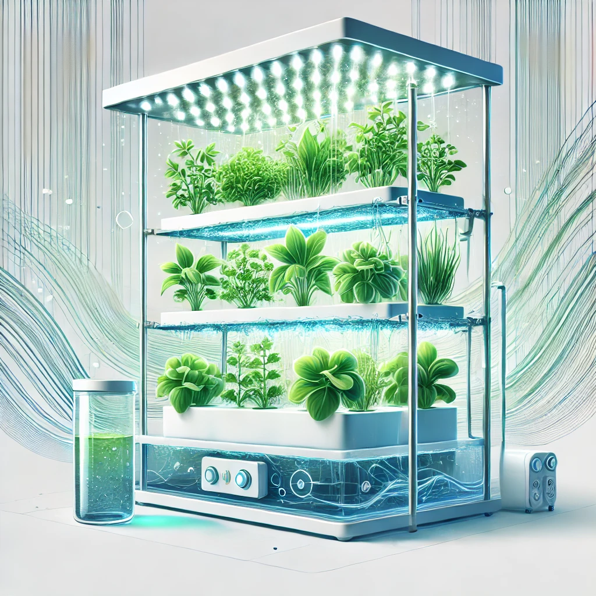

<!-- _class: lead -->

<!-- backgroundColor: '#edfded' -->

# Grassroots

**Gianluca "Bigshot" De Rossi**

---
# Disclaimer

AI? Sì grazie
30 minuti, 35 slides: Run!

---
# Cos'è l'idroponica
---
# Cosa vogliono le piante
### Acqua
---
# Cosa vogliono le piante
### Macronutrienti
---
# Cosa vogliono le piante
### Micronutrienti
---
# Fasi di crescita
---
# Varianti
### Idroponica
---
# Varianti
### Aeroponica
---
# Varianti
### Acquaponica
---
# Sistemi comuni
### Nutrient Film Tecnique
---
# Sistemi comuni
### Drip
---
# Sistemi comuni
### Wick
---
# Sistemi comuni
### DWC/Kratky
---
# Substrati
### Lana di roccia
---
# Substrati
### Fibra di cocco
---
# Substrati
### Altri substrati
---
# Strumenti essenziali
### pHmetro + ECmetro
---
# Componenti
### Serbatoi
---
# Componenti
### Pompe
---
# Componenti
### Timer pompe
---
# Componenti
### Chiller
---
# Componenti
### Lampade
---
# Componenti
### Sensoristica
---
# Componenti
### Grow Box
---
# Componenti
### Microcontrollore
---
# Pros & Cons
### "yeah!"
---
# Pros & Cons
### Costo sistema
---
# Pros & Cons
### Consumi energetici
---
# Pros & Cons
### Temperature
---
# Pros & Cons
### Mancanza di ossigeno alle radici
---
# Pros & Cons
### Problemi con la soluzione nutritiva
---
# Pros & Cons
### Guasti tecnici
---
# Pros & Cons
### Problemi microbiologici
---
# Lo faccio?
### Ni