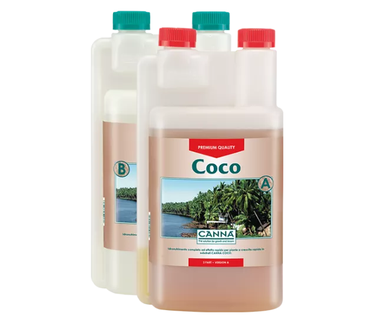

<!-- _class: lead -->

<!-- backgroundColor: '#edfded' -->

# Grassroots

**Gianluca "Bigshot" De Rossi**

Vorrei coltivare i miei "pomidori" idroponici ma non so da dove partire, come posso fare?
HACKER, NON TEMERE!

---

# Disclaimer

- AI? Sì grazie
- Sei agronomo/botanico/antani? No!
- 20 minuti, 35 slides: Run! Run! Run!

---

# Cos'è l'idroponica

* Coltivazione senza suolo
* Nutrienti disciolti in acqua
* Controllo preciso dei fattori ambientali

---
# Cosa vogliono le piante
### Acqua

Essenziale per la vita, trasporta nutrienti, regola la temperatura.

---

# Cosa vogliono le piante
### Macronutrienti

Nutrienti primari NPK:
- Azoto (crescita fogliare)
- Fosforo (radici e fiori)
- Potassio (resistenza e frutti)

---

# Cosa vogliono le piante
### Micronutrienti

Ferro, manganese, zinco, boro, rame, molibdeno, etc...

---

# Fasi di crescita

* Germinazione
* Crescita vegetativa
* Fioritura / Fruttificazione

---

# Varianti
### Idroponica

* Radici immerse in soluzione nutritiva
* Substrati inerti (lana di roccia, argilla espansa)
* Sistemi: NFT, Drip, Wick, DWC

---

# Varianti
### Aeroponica

* Radici sospese nell'aria
* Nebulizzazione di soluzione nutritiva
* Maggiore ossigenazione radicale

---

# Varianti
### Acquaponica

* Combinazione di idroponica e acquacoltura
* Pesci forniscono nutrienti alle piante
* Piante filtrano l'acqua per i pesci

---

# Sistemi più comuni
### Nutrient Film Tecnique

* Flusso continuo di soluzione nutritiva
* Radici immerse in un sottile film d'acqua
* Sistema più comune e documentato

---

# Sistemi più comuni
### Drip

* Irrigazione a gocciolamento
* Substrato trattiene l'umidità
* Facile realizzazione

---

# Sistemi più comuni
### Wick

* Soluzione nutritiva risale per capillarità
* Scalabile / Adatto ad orti idroponici grandi

---

# Sistemi più comuni
### DWC/Kratky

* Radici immerse in soluzione nutritiva areata
* Costruzione semplicissima e super economica
* Richiede un buon controllo dell'ossigenazione e della temperatura

---

---

# Substrati
### Lana di roccia

* Inerte, sterile, trattiene l'umidità
* Facile da usare, ma non biodegradabile
* Popolare in sistemi NFT e Drip
* Disponibile in blocchetti di forma regolare

---

# Substrati
### Fibra di cocco (Coco coir)

* Rinnovabile, trattiene acqua e aria
* Materiale di recupero
* Miscelata ad altri substrati

---

# Substrati
### Altri substrati

* Argilla espansa
* Perlite
* Vermiculite
* Palline di argilla
* Zeolite

---

# Strumenti essenziali
### pHmetro + ECmetro

* Misurano pH e conducibilità elettrica della soluzione nutritiva
* Essenziali per monitorare e correggere i livelli di nutrienti

---

# Componenti
### Serbatoi

- Le dimensioni devono essere adeguate
- Vanno tenuti all'ombra.

---

# Componenti
### Pompe

Bzzzzz

---

# Componenti
### Chiller

* Raffredda la soluzione nutritiva in climi caldi
* Previene stress termico alle radici
* Aiuta a prevenire crescite microbiologiche indesiderate

---

# Componenti
### Lampade

* Forniscono luce artificiale per la fotosintesi indoor
* Tipo e spettro regolate in base alle fasi di crescita

---

# Componenti
### Sensoristica

Raccogliere costantemente dati sulla soluzione nutritiva o sull'atmosfera può aiutare a capire e risolvere eventuali segnali di sofferenza delle piante.

---

# Componenti
### Grow Box

* Struttura per contenere la coltivazione in ambiente controllato
* Isolamento termico
* Controllo odori (filtri a carboni attivi)

---

# Componenti
### Microcontrollori & co.

Siamo all'ESC: mettete assieme tutto quello che abbiamo visto prima, no?

---

# Pros & Cons
### "Yeah!"

* Maggiore resa e qualità
* Risparmio idrico
* Coltivazione tutto l'anno
* Crescita molto veloce
* Riduzione di parassiti e malattie

---

# Pros & Cons
### Costo sistema

* Investimento iniziale più elevato rispetto alla coltivazione tradizionale
* Componenti e materiali specifici

---

# Pros & Cons
### Consumi energetici

Pompe, luci, chiller richiedono (molta) energia elettrica.

---

# Pros & Cons
### Temperature

* Necessità di mantenere temperature ottimali per mantenere le piante in salute
* L'ambiente esterno tenterà in tutti i modi di rovinarvi i piani

---

# Pros & Cons
### Mancanza di ossigeno alle radici

* Rischio in alcuni sistemi, soprattutto DWC/Kratky
* Pompette da acquario FTW
* Splash!

---

# Pros & Cons
### Problemi con la soluzione nutritiva

L'utilizzo prolungato nel tempo di singolo batch di soluzione nutritiva porta ad accumuli e squilibri nei nutrienti. Spreco di nutrienti per prepararne di nuova previa sanificazione dell'impianto.

---

# Pros & Cons
### Guasti tecnici

TUTTO QUELLO CHE NON C'È NON SI PUÒ ROMPERE

---

# Pros & Cons
### Problemi microbiologici

* Puzza
* Alghe e batteri possono proliferare
* Igiene e pulizia fondamentali
* Materiali potenzialmente pericolosi

---

# Lo faccio?
## &nbsp;&nbsp;&nbsp;&nbsp;&nbsp;&nbsp;&nbsp;&nbsp;&nbsp;&nbsp;&nbsp;&nbsp;&nbsp;&nbsp;&nbsp;&nbsp;&nbsp;&nbsp;&nbsp;&nbsp;&nbsp;&nbsp;&nbsp;&nbsp;&nbsp;&nbsp;&nbsp;&nbsp;&nbsp;&nbsp;&nbsp;&nbsp;&nbsp;&nbsp;&nbsp;&nbsp;&nbsp;&nbsp;&nbsp;&nbsp;&nbsp;&nbsp;&nbsp;&nbsp;&nbsp;&nbsp;&nbsp;NI
